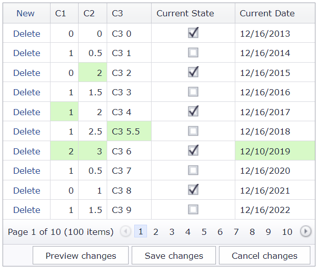

<!-- default badges list -->

[](https://supportcenter.devexpress.com/ticket/details/T150411)
[](https://docs.devexpress.com/GeneralInformation/403183)
[](#does-this-example-address-your-development-requirementsobjectives)
<!-- default badges end -->
# Grid View for ASP.NET MVC - How to implement custom buttons in the status bar in batch edit mode

This example demonstrates how to implement a status bar template to replace default command buttons with custom buttons when the grid is in batch edit mode.



## Overview

Follow the steps below:

1. Call the grid's [SetStatusBarTemplateContent](https://docs.devexpress.com/AspNetMvc/DevExpress.Web.Mvc.GridViewSettings.SetStatusBarTemplateContent(System.Action-DevExpress.Web.GridViewStatusBarTemplateContainer-)) method, add custom command buttons to the template, and handle their `Click` events.

    ```csharp
    settings.Styles.StatusBar.CssClass = "StatusBarWithButtons";
    settings.SetStatusBarTemplateContent(c => {
        Html.DevExpress().Button(button => {
            button.Name = "btnPrevChanges";
            button.Text = "Preview changes";
            button.ClientSideEvents.Click = "OnPreviewChangesClick";
            // ...
        }).Render();

        Html.DevExpress().Button(button => {
            button.Name = "btnSave";
            button.Text = "Save changes";
            button.ClientSideEvents.Click = "function(s, e){ GridView.UpdateEdit(); }";
            // ...
        }).Render();

        @Html.DevExpress().Button(button => {
            button.Name = "btnCancel";
            button.Text = "Cancel changes";
            button.ClientSideEvents.Click = "function(s, e){ GridView.CancelEdit(); SetButtonsVisibility(GridView); }";
            ...
        }).Render();
    });
    ```

    ```js
    function OnPreviewChangesClick(s, e) {
        if (isPreviewChangesVisible) {
            s.SetText("Show changes");
            GridView.batchEditApi.HideChangesPreview();
        }
        else {
            s.SetText("Hide preview");
            GridView.batchEditApi.ShowChangesPreview();
        }
        isPreviewChangesVisible = !isPreviewChangesVisible;
    }
    function OnCustomButtonClick(s, e) {
        if (e.buttonID == "deleteButton") {
            s.DeleteRow(e.visibleIndex);
            SetButtonsVisibility(s);
        }
    }
    ```

2. Handle the grid's [BatchEditEndEditing](http://docs.devexpress.com/AspNet/js-ASPxClientGridView.BatchEditEndEditing) event to change the custom button visibility. In this example, custom buttons imitate the behavior of default buttons:

   * The buttons are hidden when the grid has no changes.
   * The **Preview changes** button changes its text to **Hide preview** when clicked.

    ```js
    function OnBatchEditEndEditing(s, e) {
        window.setTimeout(function () { SetButtonsVisibility(s); }, 0);
    }
    function SetButtonsVisibility(s) {
        var statusBar = s.GetMainElement().getElementsByClassName("StatusBarWithButtons")[0].getElementsByTagName("td")[0];
        if (!s.batchEditApi.HasChanges())
            statusBar.style.visibility = "hidden";
        else
            statusBar.style.visibility = "visible";
    }
    ```

## Files to Review

* [_GridViewPartial.cshtml](./CS/T150411/Views/Home/_GridViewPartial.cshtml) (VB: [_GridViewPartial.vbhtml](./VB/T150411/Views/Home/_GridViewPartial.vbhtml))
* [Index.cshtml](./CS/T150411/Views/Home/Index.cshtml) (VB: [Index.vbhtml](./VB/T150411/Views/Home/Index.vbhtml))

## Documentation

* [Batch Edit Mode](https://docs.devexpress.com/AspNetMvc/16147/components/grid-view/data-editing-and-validation/batch-edit)

## More Examples

* [Batch Editing](https://demos.devexpress.com/MVCxGridViewDemos/Editing/BatchEditing)
* [GridView for Web Forms - How to implement custom buttons in the status bar in batch edit mode](https://github.com/DevExpress-Examples/asp-net-web-forms-gridview-custom-buttons-in-batch-edit-mode)
<!-- feedback -->
## Does this example address your development requirements/objectives?

[](https://www.devexpress.com/support/examples/survey.xml?utm_source=github&utm_campaign=asp-net-mvc-grid-custom-buttons-in-batch-mode&~~~was_helpful=yes) [](https://www.devexpress.com/support/examples/survey.xml?utm_source=github&utm_campaign=asp-net-mvc-grid-custom-buttons-in-batch-mode&~~~was_helpful=no)

(you will be redirected to DevExpress.com to submit your response)
<!-- feedback end -->
